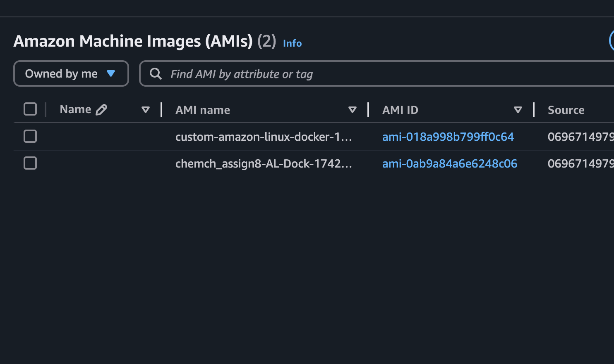
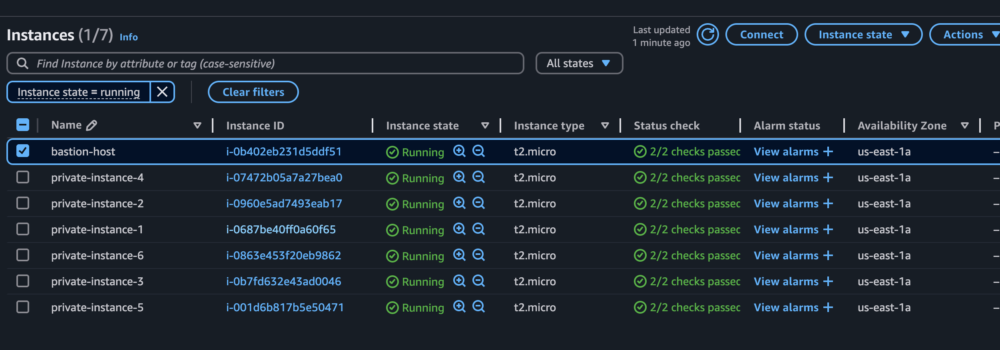

# CS 686 - Assignment 8
 Packer and Terraform Assignment

# My Journey

- Had to change to .hcl file and init Packer via:

    - packer init .

# How to Build/Run

## Part 1 - Build Custom AMI using Packer

1. Set your AWS Variables:

    - export AWS_ACCESS_KEY_ID=[YOUR_KEY_ID]
    - export AWS_SECRET_ACCESS_KEY=[YOUR_SECRET_ACCESS_KEY]
    - export AWS_SESSION_TOKEN=[YOUR_SESSION_TOKEN] 

2. Set your Public Key Variable on your Local Machine:

    - export ssh_public_key="$(cat ~/.ssh/id_rsa.pub)"

2. 1. If you don't have a Public Key you will need to generate one. Ask ChatGPT how to do that...

3. Switch into the Packer Directory an Run the Packer Build and provide your SSH Public Key as a Parameter

    - packer build -var="ssh_public_key=$(cat ~/.ssh/id_rsa.pub)" .

## Part 2 - Deploy Resources using Terraform

# Example Log Output

## Packer Build Output:

==> Wait completed after 7 minutes 5 seconds

==> Builds finished. The artifacts of successful builds are:
--> amazon-ebs.custom: AMIs were created:
us-east-1: ami-018a998b799ff0c64

## Confirmation Able to SSH to Instance Using New AMI

packer % ssh -i ~/.ssh/id_rsa ec2-user@IP        
The authenticity of host '52.70.202.61 (52.70.202.61)' can't be established.
ED25519 key fingerprint is SHA256:[SHA HASH].

   ,     #_
   ~\_  ####_        Amazon Linux 2
  ~~  \_#####\
  ~~     \###|       AL2 End of Life is 2026-06-30.
  ~~       \#/ ___
   ~~       V~' '->
    ~~~         /    A newer version of Amazon Linux is available!
      ~~._.   _/
         _/ _/       Amazon Linux 2023, GA and supported until 2028-03-15.
       _/m/'           https://aws.amazon.com/linux/amazon-linux-2023/

Evidence of New AMI:

## Confirmation Terraform Apply Created Resources

Apply complete! Resources: 25 added, 0 changed, 0 destroyed.

Outputs:

bastion_public_ip = "100.26.101.242"
private_instance_ids = [
  "i-0687be40ff0a60f65",
  "i-0960e5ad7493eab17",
  "i-0b7fd632e43ad0046",
  "i-07472b05a7a27bea0",
  "i-001d6b817b5e50471",
  "i-0863e453f20eb9862",
]
vpc_id = "vpc-077d4665d9cce9b36"

## Evidence EC2s are Running

## Evidence Resources are Destroyed on Destroy Command

aws_security_group.private_sg: Destruction complete after 1s
module.vpc.aws_vpc.this[0]: Destroying... [id=vpc-077d4665d9cce9b36]
module.vpc.aws_vpc.this[0]: Destruction complete after 1s

Destroy complete! Resources: 25 destroyed.

# Misc Notes

terraform plan -var="my_ip=148.64.107.19/32" -var="bastion_ami=ami-0c2b8ca1dad447f8a" -var="custom_ami_id=ami-0ab9a84a6e6248c06" -var="key_name=assign8-key"

terraform apply -var="my_ip=148.64.107.19/32" -var="bastion_ami=ami-0c2b8ca1dad447f8a" -var="custom_ami_id=ami-0ab9a84a6e6248c06" -var="key_name=assign8-key"

terraform destroy -var="my_ip=148.64.107.19/32" -var="bastion_ami=ami-0c2b8ca1dad447f8a" -var="custom_ami_id=ami-0ab9a84a6e6248c06" -var="key_name=assign8-key"

 ssh -i ~/.ssh/assign8-key.pem ec2-user@<bastion_public_ip>

