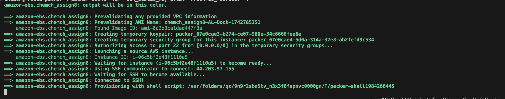
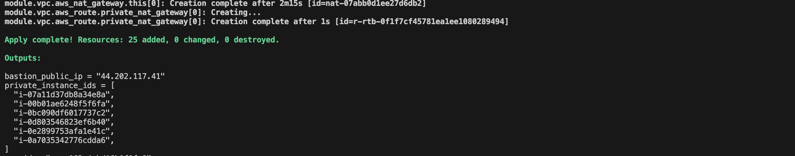
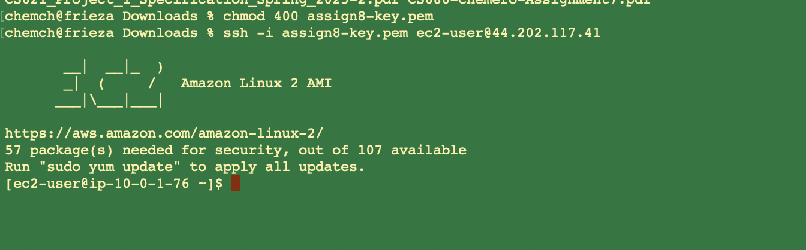
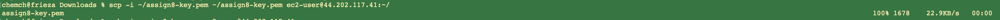
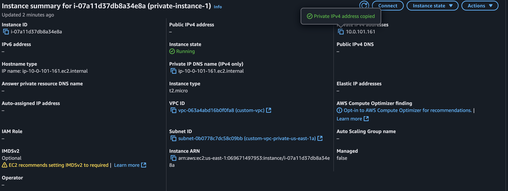
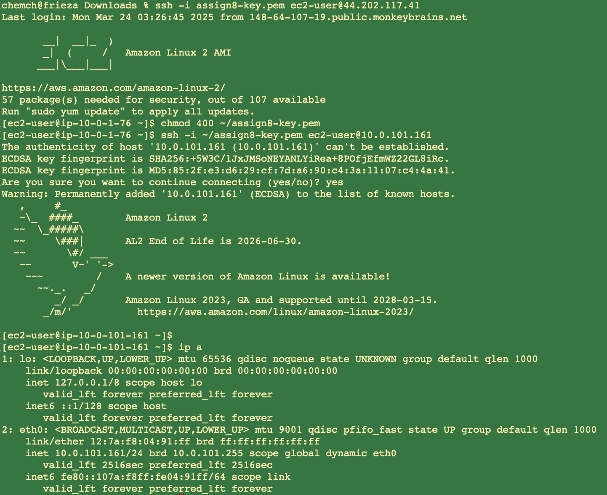
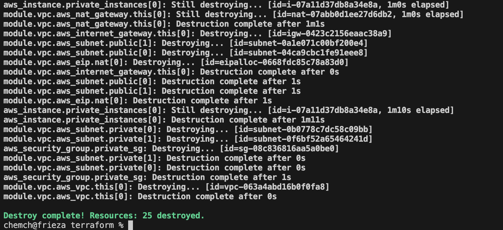

# CS 686 - Assignment 8

 Packer and Terraform Assignment

# How to Build/Run

## Part 1 - Build Custom AMI using Packer

1. Set your AWS Variables:

    - export AWS_ACCESS_KEY_ID=[YOUR_KEY_ID]
    - export AWS_SECRET_ACCESS_KEY=[YOUR_SECRET_ACCESS_KEY]
    - export AWS_SESSION_TOKEN=[YOUR_SESSION_TOKEN] 

2. Set your Public Key Variable on your Local Machine:

    - export ssh_public_key="$(cat ~/.ssh/id_rsa.pub)"

2. 1. If you don't have a Public Key you will need to generate one. 

3. Switch into the Packer Directory an Run the Packer Build and provide your SSH Public Key as a Parameter

    - packer build -var="ssh_public_key=$(cat ~/.ssh/id_rsa.pub)" .

4. Confirm the process worked. You should see packer build the AMI:

Record the new AMI that was created as you will need it later:

==> Builds finished. The artifacts of successful builds are:
--> amazon-ebs.chemch_assign8: AMIs were created:
us-east-1: ami-0a205789394892c73

## Part 2 - Deploy Resources using Terraform

1. Change directories into the terraform folder

2. Initialize terraform

  - terraform init

3. Run terroform plan to make sure it shows the right resources will get created.

  - terraform plan -var="my_ip=[YOUR_LOCAL_MACHINE_PUBLIC_IP]/32" -var="bastion_ami=ami-0c2b8ca1dad447f8a" -var="custom_ami_id=[AMI_CREATED_IN_PART_1]" -var="key_name=[YOUR_EC2_KEY_PAIR]"

4. Now deploy your plan. 

  - terraform apply -var="my_ip=[YOUR_LOCAL_MACHINE_PUBLIC_IP]/32" -var="bastion_ami=ami-0c2b8ca1dad447f8a" -var="custom_ami_id=[AMI_CREATED_IN_PART_1]" -var="key_name=[YOUR_EC2_KEY_PAIR]"

  Accept the prompt by entering 'yes'. 

You should see the resources getting created like this:

5. SSH into your Bastion host using this command:

  - ssh -i ~/.ssh/assign8-key.pem ec2-user@[YOUR_BASTION_PUBLIC_IP]

  Once you SSH in you should see the Amazon Linux Logo like this:

  

6. Now SSH from the Bastion host to one of the Private Hosts:

First you need to copy your Private Key to the Bastion Host like this:

- scp -i ~/.ssh/assign8-key.pem ~/.ssh/assign8-key.pem ec2-user@[YOUR_BASTION_PUBLIC_IP]:~/

Screenshot: 

Now you can SSH to the private hosts from your Bastion host. First get the Private IP of one of your private EC2 Instances.

AWS Instance with Private IP:

Example Command:
- ssh -i ~/assign8-key.pem ec2-user@[YOUR_PRIVATE_INSTANCE_IP]

Screenshot:

7. Finally, so you don't rack up cost you can destroy your resources. 

- terraform destroy -var="my_ip=[YOUR_LOCAL_MACHINE_PUBLIC_IP]/32" -var="bastion_ami=ami-0c2b8ca1dad447f8a" -var="custom_ami_id=[AMI_CREATED_IN_PART_1]" -var="key_name=[YOUR_EC2_KEY_PAIR]"

Screenshot:

# Example Log Output

## Packer Build Output:

==> Wait completed after 7 minutes 5 seconds

==> Builds finished. The artifacts of successful builds are:
--> amazon-ebs.custom: AMIs were created:
us-east-1: ami-018a998b799ff0c64

## Confirmation Able to SSH to Instance Using New AMI

packer % ssh -i ~/.ssh/id_rsa ec2-user@IP        
The authenticity of host '52.70.202.61 (52.70.202.61)' can't be established.
ED25519 key fingerprint is SHA256:[SHA HASH].

   ,     #_
   ~\_  ####_        Amazon Linux 2
  ~~  \_#####\
  ~~     \###|       AL2 End of Life is 2026-06-30.
  ~~       \#/ ___
   ~~       V~' '->
    ~~~         /    A newer version of Amazon Linux is available!
      ~~._.   _/
         _/ _/       Amazon Linux 2023, GA and supported until 2028-03-15.
       _/m/'           https://aws.amazon.com/linux/amazon-linux-2023/

Evidence of New AMI:

## Confirmation Terraform Apply Created Resources

Apply complete! Resources: 25 added, 0 changed, 0 destroyed.

Outputs:

bastion_public_ip = "100.26.101.242"
private_instance_ids = [
  "i-0687be40ff0a60f65",
  "i-0960e5ad7493eab17",
  "i-0b7fd632e43ad0046",
  "i-07472b05a7a27bea0",
  "i-001d6b817b5e50471",
  "i-0863e453f20eb9862",
]
vpc_id = "vpc-077d4665d9cce9b36"

## Evidence EC2s are Running

## Evidence Resources are Destroyed on Destroy Command

aws_security_group.private_sg: Destruction complete after 1s
module.vpc.aws_vpc.this[0]: Destroying... [id=vpc-077d4665d9cce9b36]
module.vpc.aws_vpc.this[0]: Destruction complete after 1s

Destroy complete! Resources: 25 destroyed.

# Misc Notes

terraform plan -var="my_ip=148.64.107.19/32" -var="bastion_ami=ami-0c2b8ca1dad447f8a" -var="custom_ami_id=ami-0ab9a84a6e6248c06" -var="key_name=assign8-key"

terraform apply -var="my_ip=148.64.107.19/32" -var="bastion_ami=ami-0c2b8ca1dad447f8a" -var="custom_ami_id=ami-0ab9a84a6e6248c06" -var="key_name=assign8-key"

terraform destroy -var="my_ip=148.64.107.19/32" -var="bastion_ami=ami-0c2b8ca1dad447f8a" -var="custom_ami_id=ami-0ab9a84a6e6248c06" -var="key_name=assign8-key"

 ssh -i ~/.ssh/assign8-key.pem ec2-user@<bastion_public_ip>

# Gotchas

- Had to change to .hcl file and init Packer via:

    - packer init .
